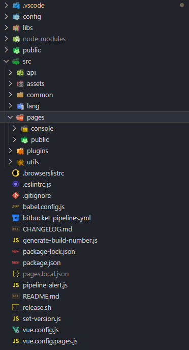

vue.config.js

```javascript
//https://cli.vuejs.org/zh/config/#vue-config-js
const CompressionWebpackPlugin = require("compression-webpack-plugin");
const getPages = require("./vue.config.pages.js");

module.exports = {
  pages: getPages(process.env.NODE_ENV === "production"),
  productionSourceMap: false,
  configureWebpack: {
    devtool: "source-map",
    plugins: [
      new CompressionWebpackPlugin({
        filename: "[path].gz[query]",
        algorithm: "gzip",
        test: new RegExp("\\.(" + ["js", "css"].join("|") + ")$"),
        threshold: 10240,
        minRatio: 0.8,
      }),
    ],
  },
};

```

vue.config.pages.js

```javascript
/**
 * 生成多頁面的主 html 檔案。Production 時會全部模塊生成，但開發時可選擇只生成部份 html。
 * 見：buildKeys
 * 可用 "./pages.local.json" 設置所需 build 的模塊
 */
const glob = require("glob");
const { version } = require("./package.json");
const localPageListConfigFile = "./pages.local.json";

const ALL_MODULES = ["public", "console"];
const DEFAULT_MODULES = ["public", "console"];
const ROOT_PAGE = "public"; // index.html對應的頁面所屬於的模塊

module.exports = function getPages(isProduction) {
  const suffix = isProduction ? ".html" : "";

  const pages = {};
  const files = glob.sync("./src/pages/**/main.js");
  let buildKeys;
  if (isProduction === true) {
    // 部署時全部編譯
    buildKeys = ALL_MODULES;
  } else {
    // 本地開發時開始選擇性編譯
    try {
      // 嘗試用 json 設置檔
      const path = require.resolve(localPageListConfigFile);
      buildKeys = require(path);
    } catch (e) {
      // 不能讀取，改用默認值
      buildKeys = DEFAULT_MODULES;
    }
  }
  console.log(`Building module pages: ${JSON.stringify(buildKeys)}`);
  files.forEach((file) => {
    const arr = file.split("/");
    const key = arr[3];
    if (buildKeys.indexOf(key) === -1) {
      return;
    }
    pages[key] = {
      entry: file,
      extraScript: key === "public" ? '<script src="https://use.typekit.net/hkt1rkz.js"></script><script>try { Typekit.load({ async: true }); } catch (e) { }</script>' : '',
      template: "public/index.html",
      title: `${key.toUpperCase()} - ${version}`,
      filename: key === ROOT_PAGE ? "index.html" : key + suffix,
    };
  });
  return pages;
};

```

pages.local.json

```javascript
["public", "console"]
```

模板

 

